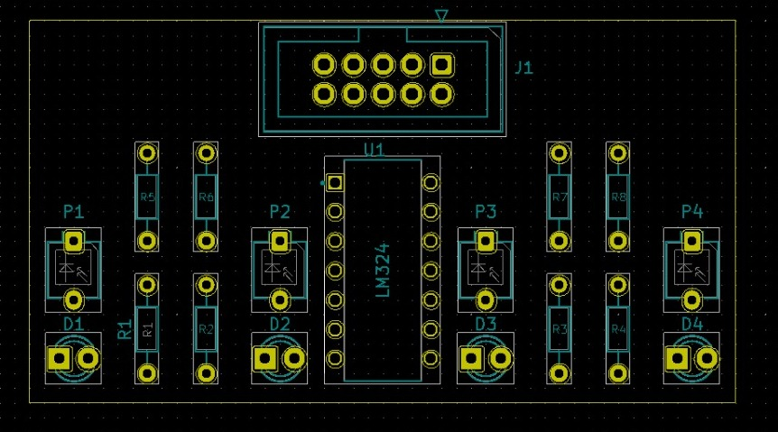

# PCB_Design_LSA

## Using kiCAD - Open Source Software
This repository contains hardware design files and datasheets for the Line Sensor Array(LSA).

## Tools
To view/modify the files from this repository, install KiCAD from: [https://kicad.org](https://kicad.org)

## PCB

## 3D View

